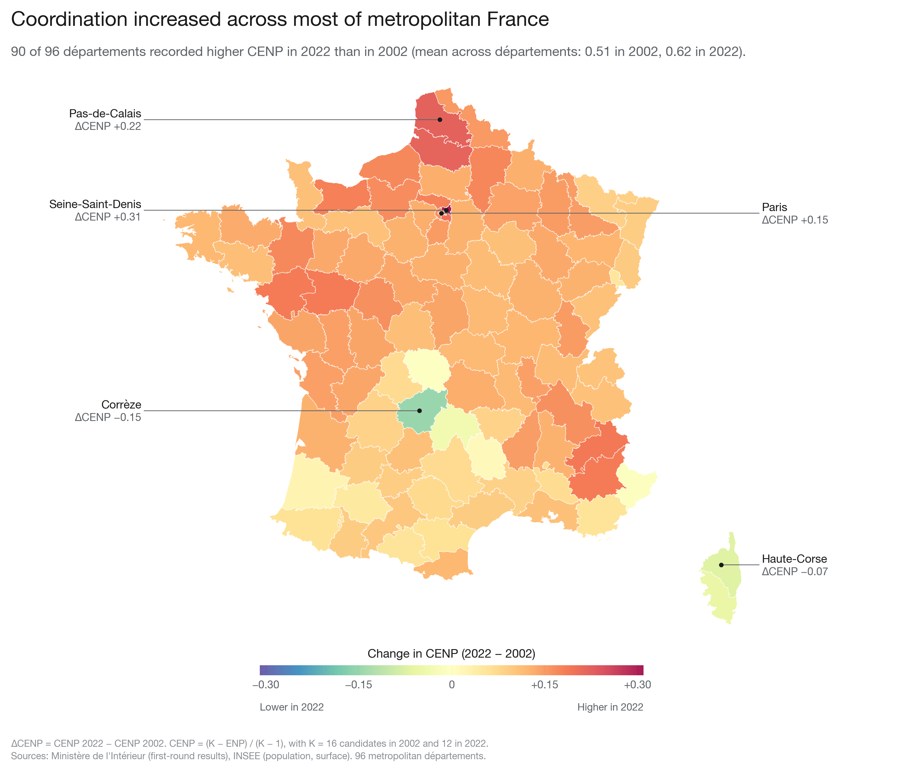
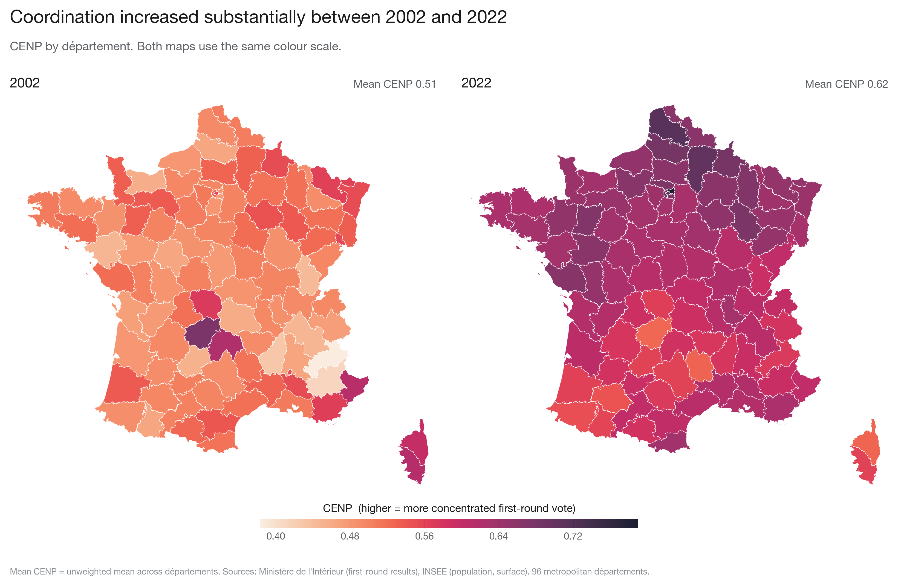
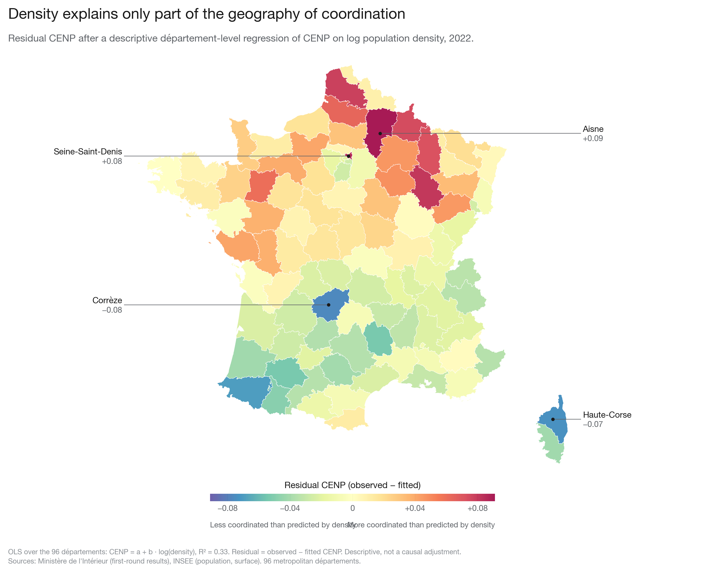

<h1 align="center">Geography of electoral coordination in France</h1>

<p align="center">
How concentrated the first-round vote was in each département in the 2002 and 2022 French presidential elections,
and how that concentration relates to population density.
</p>

<p align="center">
  <a href="https://clarasalas.github.io/strategic-voting-geo-2RS/">
    
  </a>
</p>

<p align="center">
  <a href="https://clarasalas.github.io/strategic-voting-geo-2RS/">
    
  </a>
</p>

<p align="center"><sub>
Click the map to explore every département: coordination in 2002 and 2022, population density, the position of each
département relative to the density relationship, and its first-round vote shares.
</sub></p>

## About

In a two-round election, voters who expect their preferred candidate to be eliminated can move to a candidate with a
real chance of reaching the second round, a behaviour known as strategic voting. When many voters do this, the
first-round vote concentrates on fewer candidates. This project measures that concentration across metropolitan
France and asks where it was strongest.

The main measure is CENP, the effective number of candidates rescaled so that 0 means votes spread evenly across all
candidates and 1 means every vote goes to one candidate. The cliff measures, which locate the largest drop in vote share
between consecutive candidates, complement it. The analysis covers the 96 metropolitan départements, with a
commune-level robustness analysis of about 34,000 communes per election. All results are descriptive associations, not
causal estimates.

## Main findings

Coordination was substantially higher in 2022 than in 2002. The mean CENP across départements rose from 0.51 to 0.62,
and it increased in 90 of the 96 départements. Its geography also changed between the two elections.

In 2022, denser départements and communes had more concentrated first-round votes, and this association holds under
the robustness checks of the commune audit. In 2002, the relationship is weak or absent. The negative slope in the full
commune sample comes mostly from very small communes, where a few voters mechanically inflate concentration, and it
disappears once they are excluded.

These results describe associations. They do not show that density or urbanization causes coordination.

<p align="center">
  
  
</p>

The full analysis is in `notebooks/analysis_departements.ipynb`, `analysis_communes.ipynb`, and `audit_communes.ipynb`.

## Reproduce

The data are not included in the repository, because the commune results alone take about 260 MB. The scripts rebuild
them from the public sources listed below.

```bash
pip install -r requirements.txt geopandas seaborn plotly
pip install -e .
python scripts/01_scrape_departements.py
python scripts/02_scrape_communes.py          # several hours per year without the HTML cache
python scripts/03_coordination_indices.py
python scripts/04_density.py
pytest
python scripts/build_department_explorer.py   # rebuilds the interactive page, docs/index.html
```

The static figures are produced by `notebooks/maps_departements.ipynb`, which writes them to `figures/`. The
interactive page is a single standalone HTML file, published with GitHub Pages from the `docs/` folder (see
[`docs/README.md`](docs/README.md)).

<details>
<summary><strong>Repository layout</strong></summary>

```
svgeo/                       shared code (pip install -e .)
  config.py                  paths and constants (years, K, metropolitan codes, Paris/Lyon/Marseille)
  web.py                     page download with an on-disk cache
  results_page.py            parsing a results page (first-round candidates and turnout)
  departements.py            département scraper
  communes.py                commune scraper
  indices.py                 ENP, CENP, cliff measures
  analysis.py                association statistics and plots
scripts/                     build the data, in order, then the interactive page
  01_scrape_departements.py
  02_scrape_communes.py
  03_coordination_indices.py
  04_density.py
  build_department_explorer.py   interactive map -> docs/index.html
notebooks/                   analysis (read the processed CSVs only)
  analysis_departements.ipynb
  analysis_communes.ipynb
  audit_communes.ipynb       robustness audit of the commune result
  maps_departements.ipynb    static report maps -> figures/
docs/                        GitHub Pages site (generated index.html and publishing notes)
figures/                     static figures (PNG 300 dpi and PDF)
tests/
```

</details>

<details>
<summary><strong>Pipeline</strong></summary>

| step | reads | writes |
|---|---|---|
| `01_scrape_departements.py` | election archive | `raw/presidential_{year}_department_urls.csv`, `raw/presidential_{year}_departments.csv`, `processed/presidential_departments_2002_2022.csv` |
| `02_scrape_communes.py` | département URLs, election archive | `raw/presidential_{year}_communes.csv`, `raw/presidential_{year}_communes_failures.csv`, `processed/presidential_communes_2002_2022.csv` |
| `03_coordination_indices.py` | results | `processed/coordination_indices_{departements,communes}.csv` |
| `04_density.py` | indices, INSEE files | `processed/coordination_density_departements.csv`, `processed/coordination_density_departements_wide.csv`, `processed/coordination_density_communes_corrected.csv` (and one file per year) |
| `notebooks/audit_communes.ipynb` | commune results and density | `processed/audit_corrected/*.csv` |
| `build_department_explorer.py` | département indices and density, candidate results, boundaries | `docs/index.html` |

All paths are under `data/`. A script skips any output that already exists, so running everything again rebuilds only
what is missing. Pass `--force` to rebuild anyway. Scraped pages are cached in `data/raw/html_cache*/`, so scraping can
run again from disk with `--offline`, without any download. Set `SVGEO_DATA_DIR=/path/to/data` to work on another copy
of the data folder.

</details>

<details>
<summary><strong>Data sources</strong></summary>

* **Election results**, scraped from the Ministère de l'Intérieur archive,
  <https://www.archives-resultats-elections.interieur.gouv.fr/> (presidential elections 2002 and 2022, first round).
* **INSEE files**, downloaded by hand into `data/raw/insee/`:
  * `1_Pop_annu_compo_evol_depreg.xlsx`, *Estimations de population : population annuelle et composantes de
    l'évolution démographique par département et région* (population on 1 January, one sheet per year);
  * `base-cc-serie-historique-2022.CSV` and `meta_base-cc-serie-historique-2022.CSV`, *Séries historiques du
    recensement, base communale* (commune populations `D99_POP`, `P06_POP`, `P22_POP` and surface `SUPERF`).
* **Département boundaries** for the maps, downloaded by hand into `data/raw/geography/departements-100m.geojson`
  (GeoJSON with a `code` property holding the département code, in any CRS).

</details>

<details>
<summary><strong>Methodological choices</strong></summary>

* **CENP** = `(K − ENP) / (K − 1)`, where ENP = `1 / Σ share²` is the effective number of candidates and **K** the number
  of candidates nationally (16 in 2002, 12 in 2022). A candidate with no vote in a unit has a share of 0.
* **Main samples**: the 96 metropolitan départements, and the metropolitan communes matched to INSEE, excluding 2002
  communes flagged as possible boundary changes (registered voters / population outside [0.4, 1.2]).
* **Commune density** uses the 2022 population for 2022. For 2002, it uses a geometric interpolation between the 1999
  census and 2006 (`population_2002_interp`), on the recent INSEE commune geography.
* **Paris, Lyon, and Marseille** are whole communes. Their arrondissement pages are only used to check that the totals
  add up.
* 2002 and 2022 are two separate cross-sections, not a panel.

</details>
